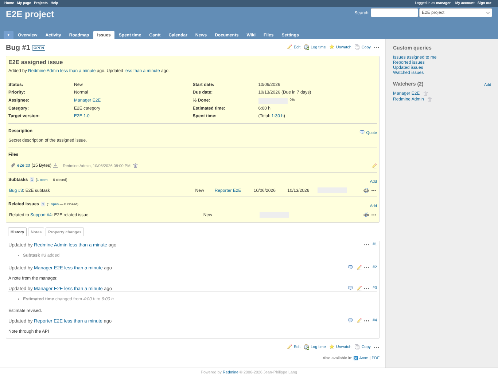

# api

Run 2026-10-06T20:00:28.591Z against http://127.0.0.1:3001.

| screenshot | user | URL | shows |
|---|---|---|---|
|  | manager | `/issues/1` | The note the reporter added through the API; estimated time still 6:00 h, assignee unchanged |

## Problems

- reporter: assigned_to = {"id":5,"name":"Manager E2E"}
- reporter: category = {"id":1,"name":"E2E category"}
- reporter: start_date = "2026-10-06"
- reporter: due_date = "2026-10-13"
- reporter: estimated_hours = 6
- reporter: total_estimated_hours = 6
- reporter: description = "Secret description of the assigned issue."
- reporter list: 5 of 5 issues carry hidden fields
- reporter xml carries hidden fields
