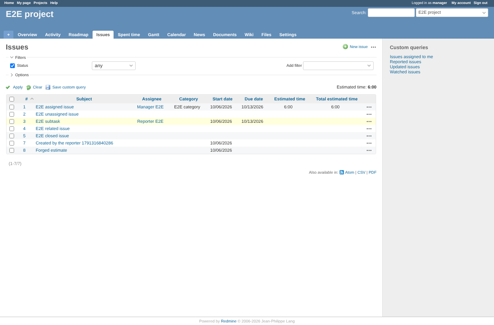
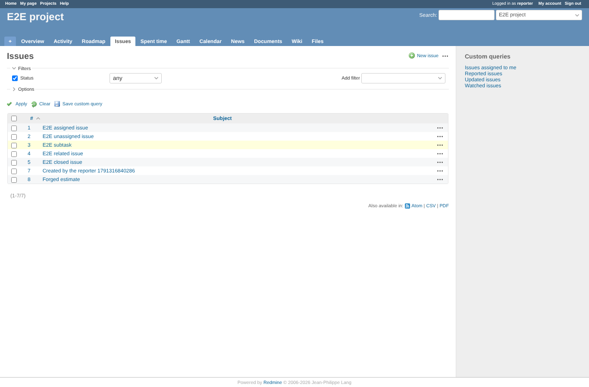
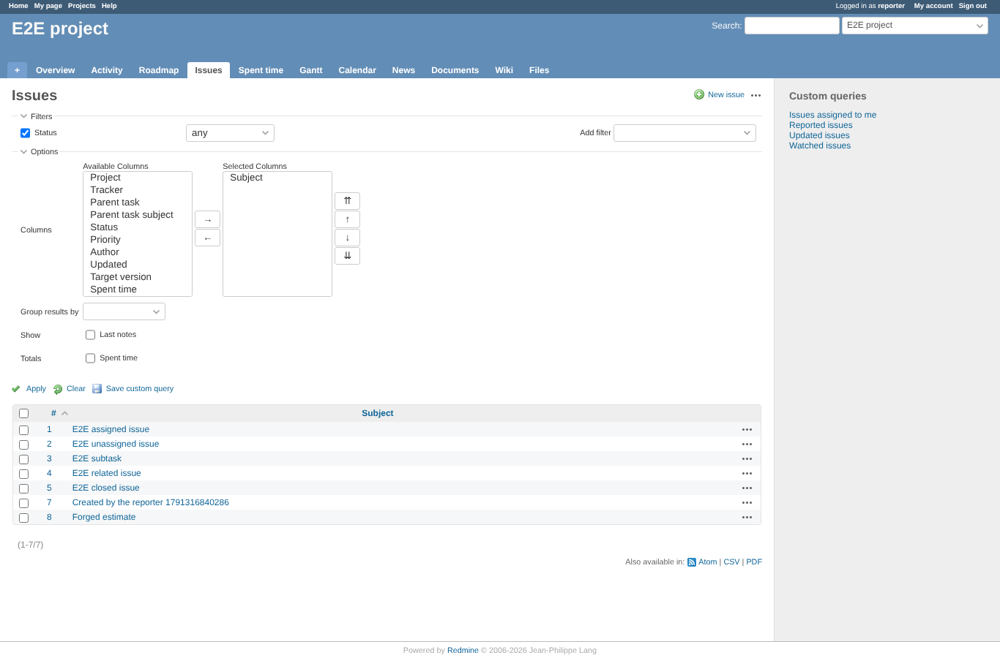
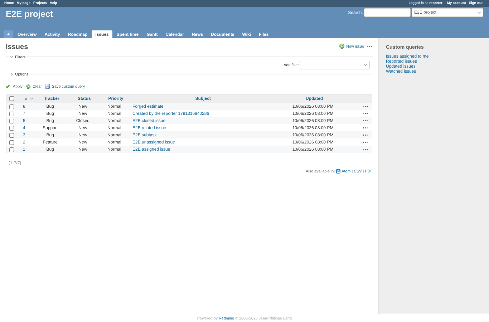
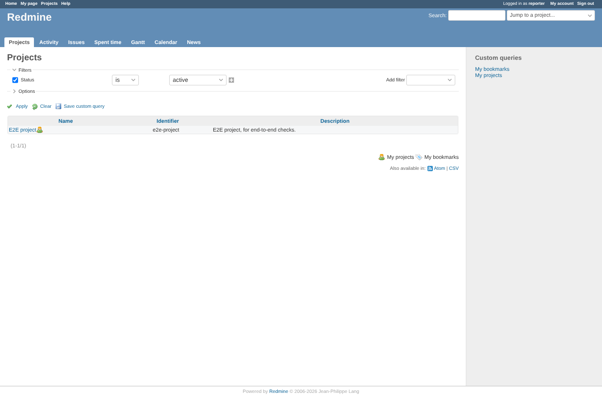

# issue-list

Run 2026-10-06T20:00:58.097Z against http://127.0.0.1:3001.

| screenshot | user | URL | shows |
|---|---|---|---|
|  | manager | `/projects/e2e-project/issues?set_filter=1&status_id=*&sort=id&c[]=subject&c[]=assigned_to&c[]=category&c[]=start_date&c[]=due_date&c[]=estimated_hours&c[]=estimated_remaining_hours&c[]=total_estimated_hours&t[]=estimated_hours&t[]=estimated_remaining_hours` | Manager: assignee, category, dates, estimated, remaining and total estimated time columns, with totals |
|  | reporter | `/projects/e2e-project/issues?set_filter=1&status_id=*&sort=id&c[]=subject&c[]=assigned_to&c[]=category&c[]=start_date&c[]=due_date&c[]=estimated_hours&c[]=estimated_remaining_hours&c[]=total_estimated_hours&t[]=estimated_hours&t[]=estimated_remaining_hours` | Reporter, same URL: only the subject column, no estimated or remaining totals |
|  | reporter | `/projects/e2e-project/issues?set_filter=1&status_id=*&sort=id&c[]=subject&c[]=assigned_to&c[]=category&c[]=start_date&c[]=due_date&c[]=estimated_hours&c[]=estimated_remaining_hours&c[]=total_estimated_hours&t[]=estimated_hours&t[]=estimated_remaining_hours` | Reporter: filters and column/total options without the hidden fields |
|  | reporter | `/projects/e2e-project/issues?set_filter=1&f[]=estimated_hours&op[estimated_hours]=%3E=&v[estimated_hours][]=5` | Reporter: a filter on estimated time in the URL is dropped, the list is not narrowed by it |
|  | reporter | `/projects?display_type=list` | Reporter: the project list as a list renders (QueriesHelper patch only touches issues, GEOxyz 4139400) |

## Problems

- manager: column estimated_remaining_hours missing
- manager: remaining time total missing
- manager: remaining time not in the column options
