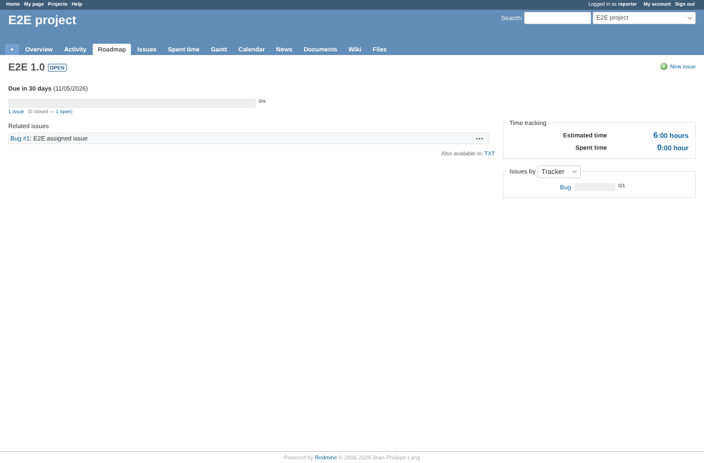
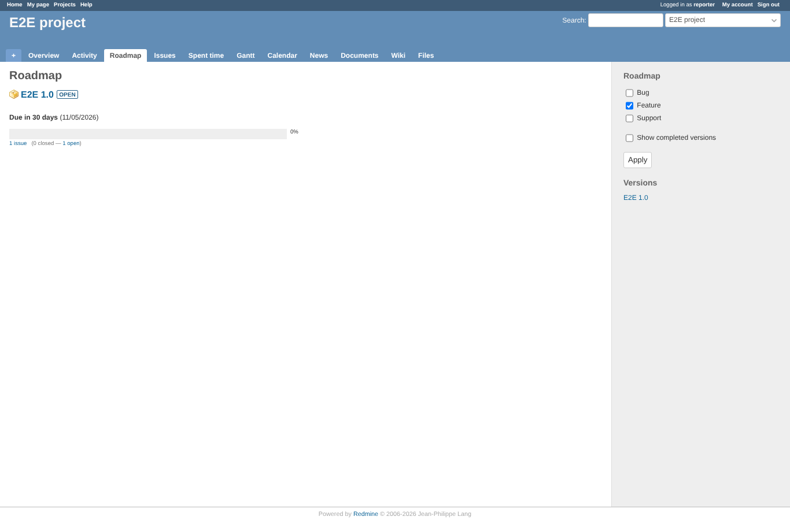

# version-page

Run 2026-10-06T20:00:34.262Z against http://127.0.0.1:3001.

| screenshot | user | URL | shows |
|---|---|---|---|
|  | manager | `/versions/1` | Manager: estimated 6:00 hours, remaining 0:00 hour |
|  | reporter | `/versions/1` | Reporter: estimated and remaining time are 0 (6:00 hours / 0:00 hour) |
|  | reporter | `/projects/e2e-project/roadmap` | Reporter: the roadmap renders |

## Problems

- manager: remaining time 0:00 hour
- reporter: version shows 6:00 hours / 0:00 hour
- reporter API: estimated_hours 6
