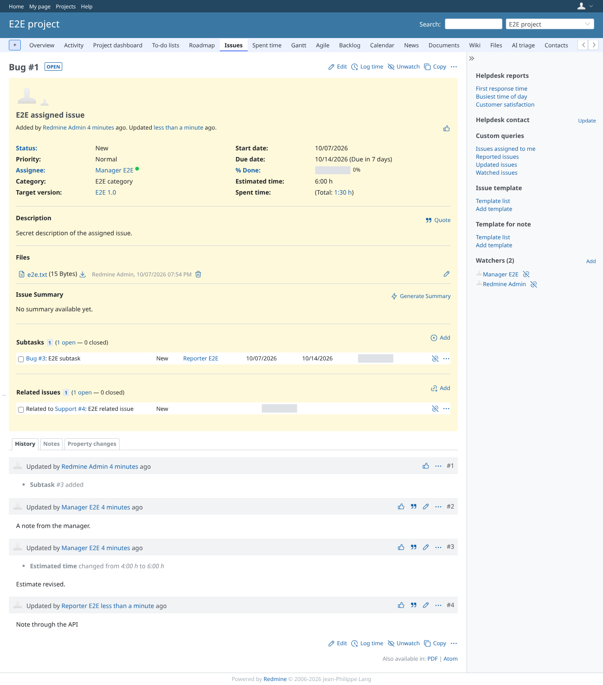

# api

Run 2026-10-07T19:58:47.658Z against http://127.0.0.1:3002.

| screenshot | user | URL | shows |
|---|---|---|---|
|  | manager | `/issues/1` | The note the reporter added through the API; estimated time still 6:00 h, assignee unchanged |
