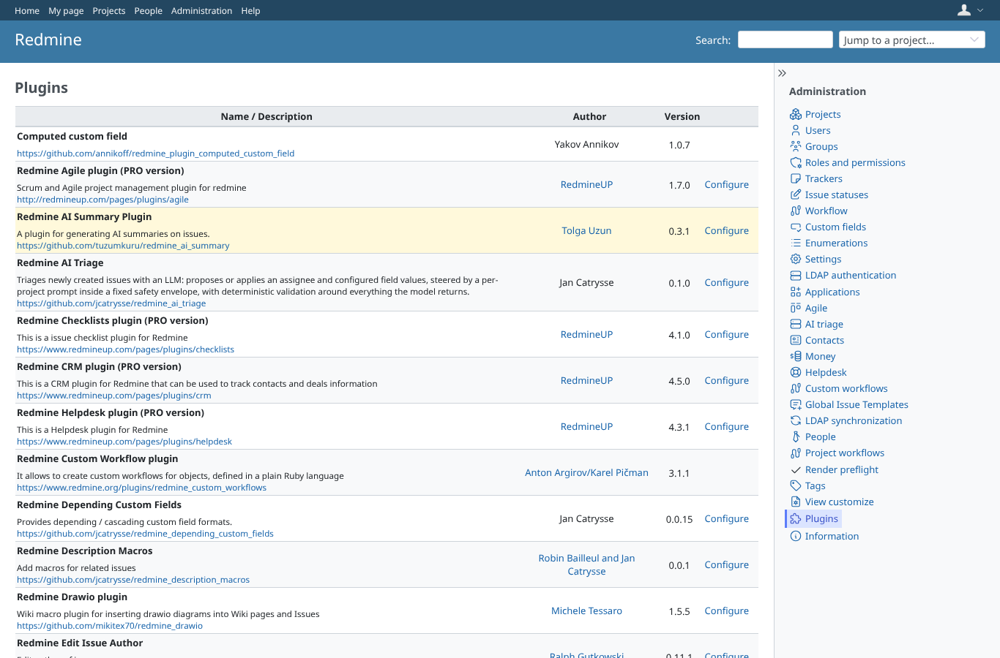
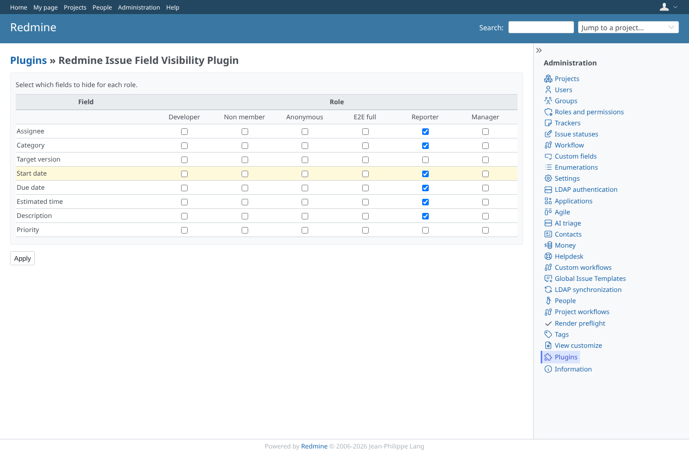
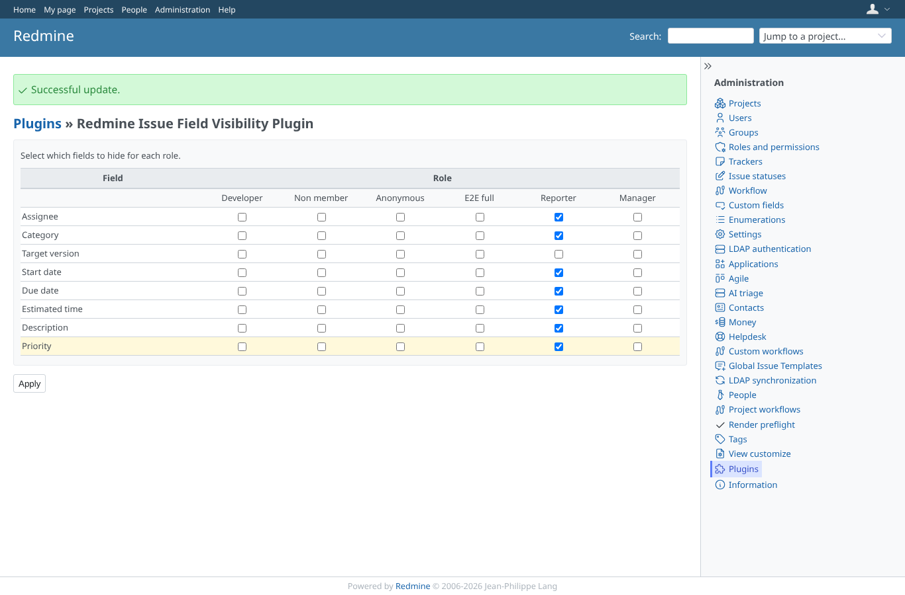
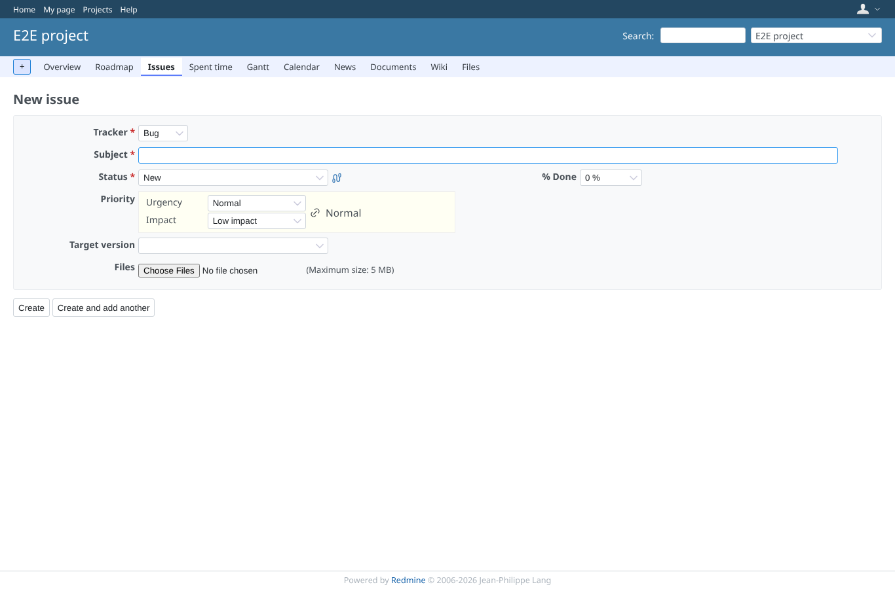

# settings

Run 2026-10-07T20:11:49.347Z against http://127.0.0.1:3002.

| screenshot | user | URL | shows |
|---|---|---|---|
|  | admin | `/admin/plugins` | The plugin is listed with a Configure link |
|  | admin | `/settings/plugin/redmine_issue_field_visibility` | The matrix: 8 fields (Assignee, Category, Target version, Start date, Due date, Estimated time, Description, Priority) per role; Reporter has six hidden |
|  | admin | `/settings/plugin/redmine_issue_field_visibility` | Saved: the success message, priority now hidden for Reporter |
|  | reporter | `/projects/e2e-project/issues/new` | With priority hidden the reporter's new issue form has no priority field |
|  | outsider | `/settings/plugin/redmine_issue_field_visibility` | The settings page is refused to a non-admin (here: outsider) |
