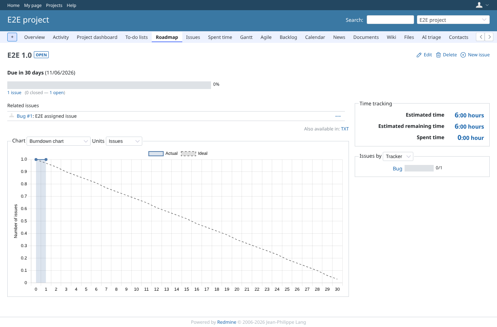
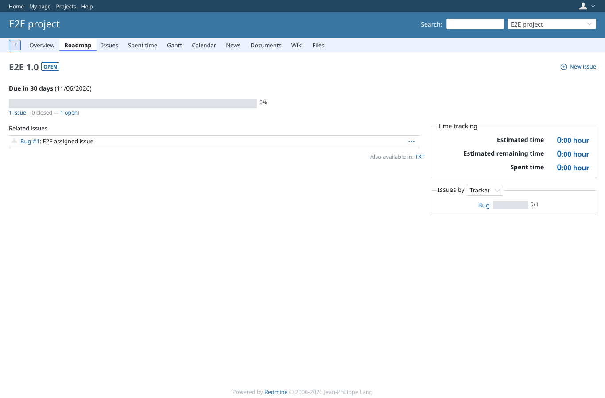
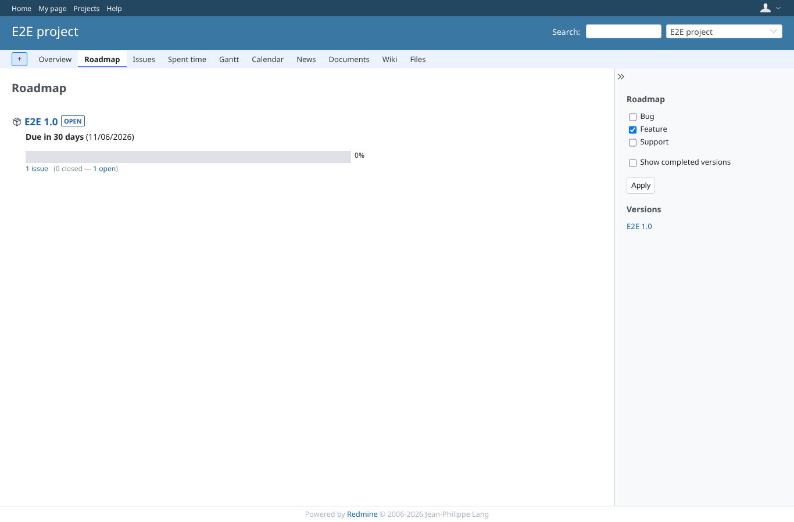

# version-page

Run 2026-10-07T20:14:44.774Z against http://127.0.0.1:3002.

| screenshot | user | URL | shows |
|---|---|---|---|
|  | manager | `/versions/1` | Manager: estimated 6:00 hours, remaining 6:00 hours |
|  | reporter | `/versions/1` | Reporter: estimated and remaining time are 0 (0:00 hour / 0:00 hour / 0:00 hour) |
|  | reporter | `/projects/e2e-project/roadmap` | Reporter: the roadmap renders |
