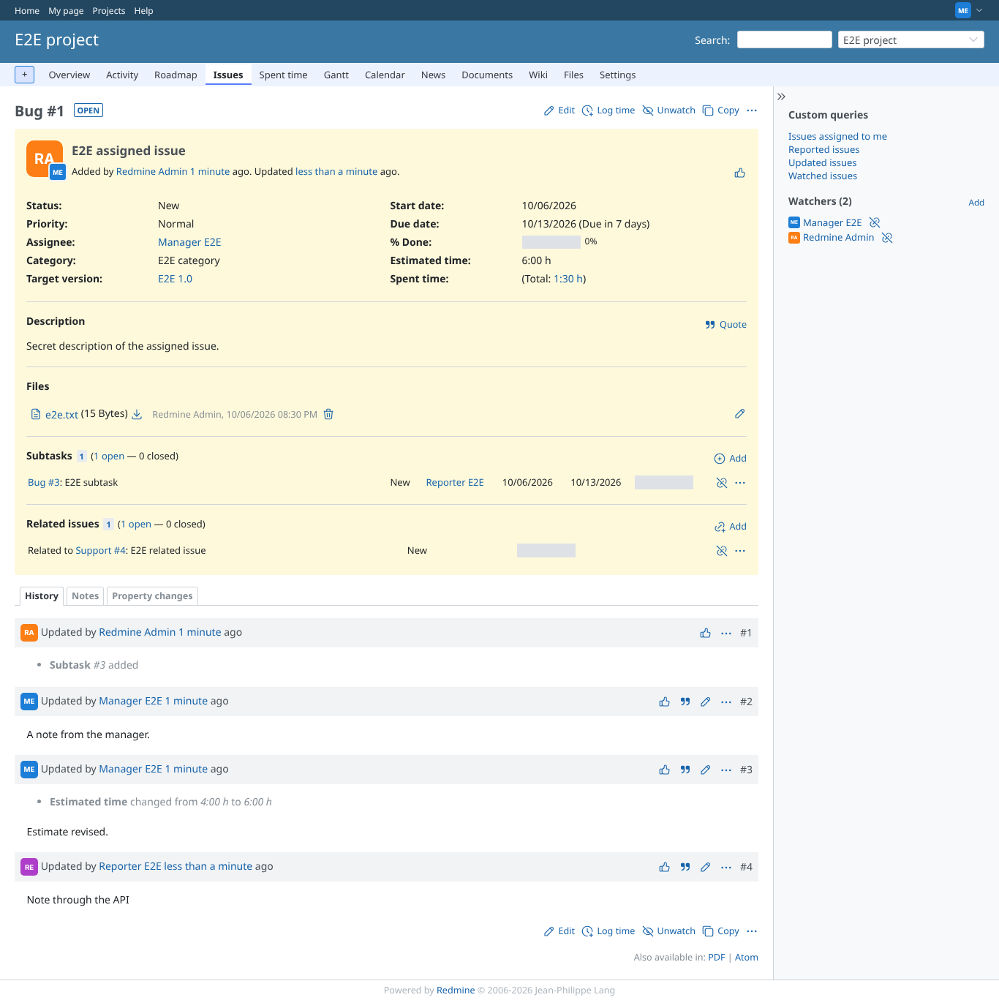
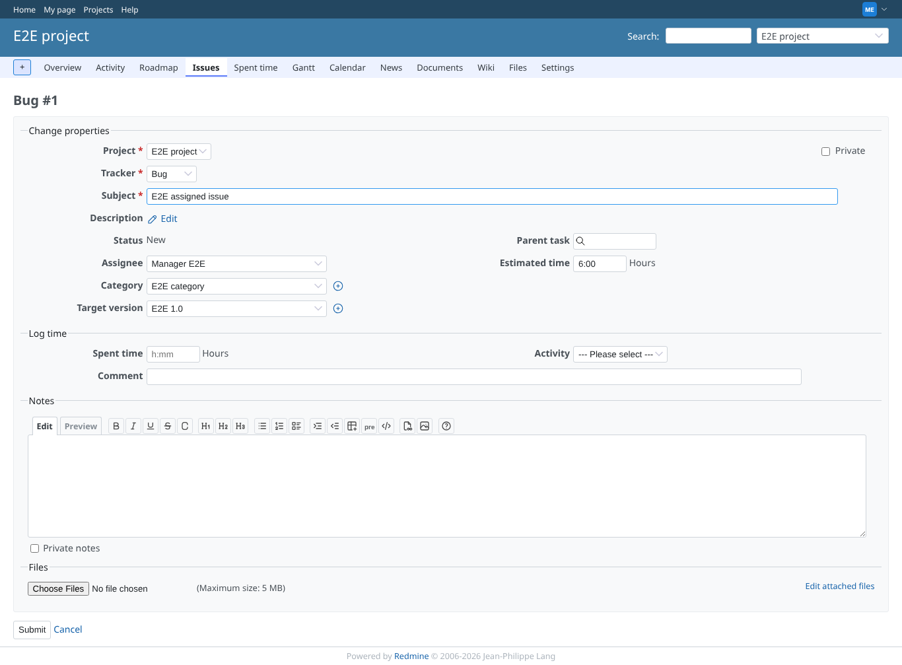
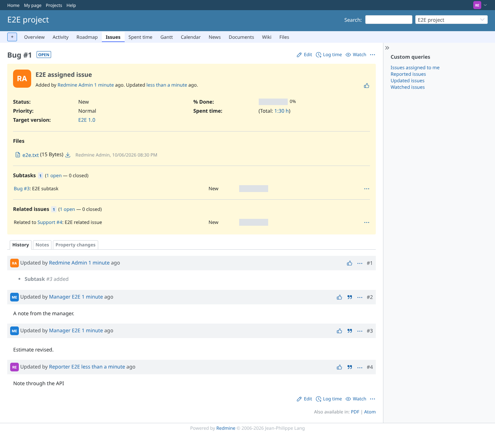
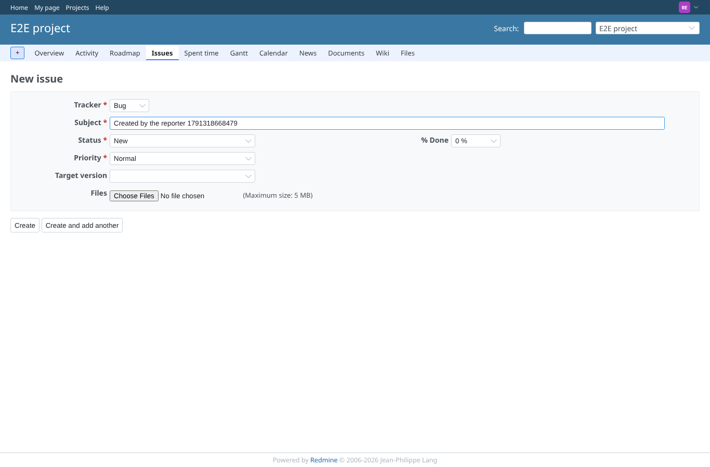
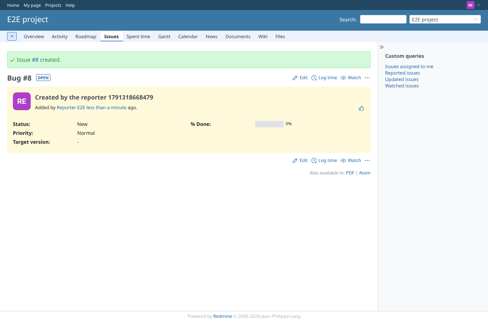
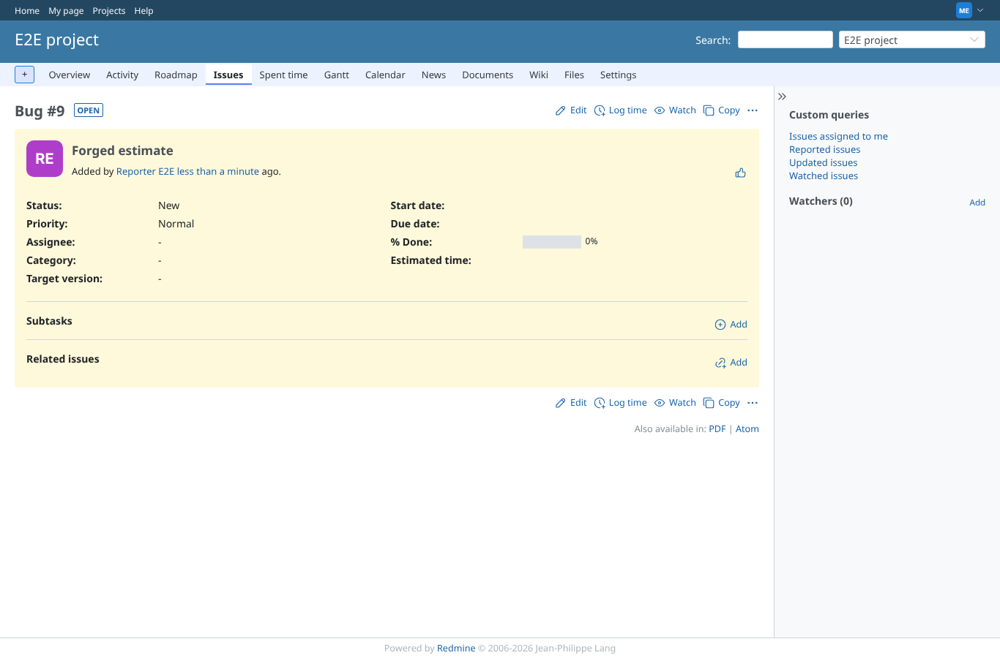
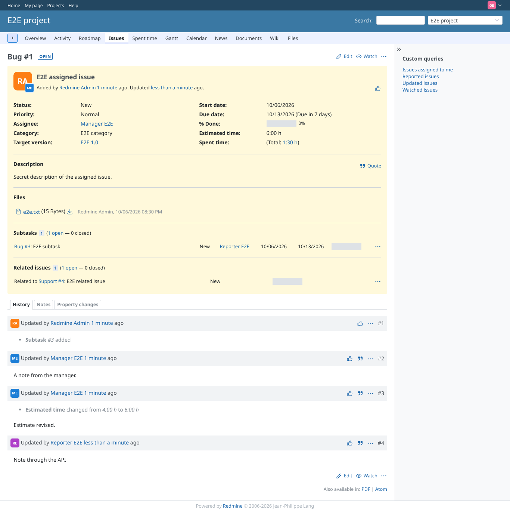

# issue-page

Run 2026-10-06T20:31:14.168Z against http://127.0.0.1:3000.

| screenshot | user | URL | shows |
|---|---|---|---|
|  | manager | `/issues/1` | Manager (no hidden fields): assignee, category, dates, estimated time, description and the estimate change in the history |
|  | manager | `/issues/1/edit` | Manager: the edit form has assignee, category, dates and estimated time |
|  | reporter | `/issues/1` | Reporter (six fields hidden): no assignee, category, dates, estimated time, description; the history keeps the note, not the estimate change |
|  | reporter | `/projects/e2e-project/issues/new` | Reporter: the new issue form without the hidden fields |
|  | reporter | `/issues/8` | Reporter: the issue is created; the hidden fields are not shown on it |
|  | manager | `/issues/9` | Manager: issue #9, posted by the reporter with estimated_hours=77, has no estimated time |
|  | outsider | `/issues/1` | Outsider (no membership) sees the public issue as a non member: Non member hides nothing |
