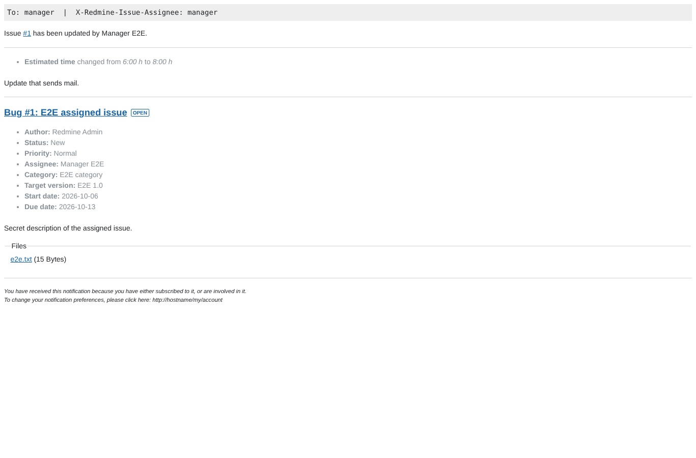
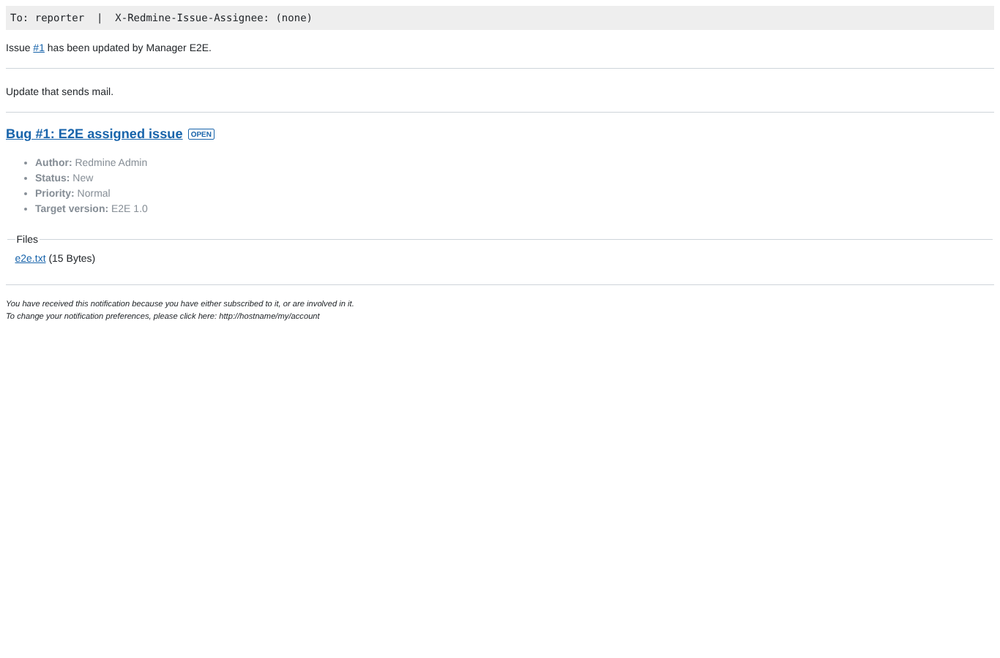

# mail

Run 2026-10-06T19:54:18.087Z against http://127.0.0.1:3000.

| screenshot | user | URL | shows |
|---|---|---|---|
|  | manager | `/issues/1` | The update mail as manager received it: assignee header and line, category, estimate change and description |
|  | manager | `/issues/1` | The update mail as reporter received it: no assignee header or line, no category, no estimate change, no description; the note is there |
