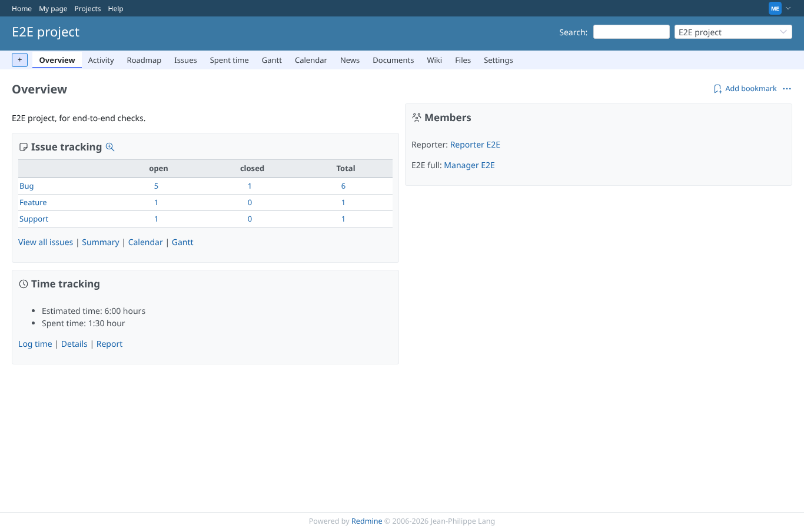
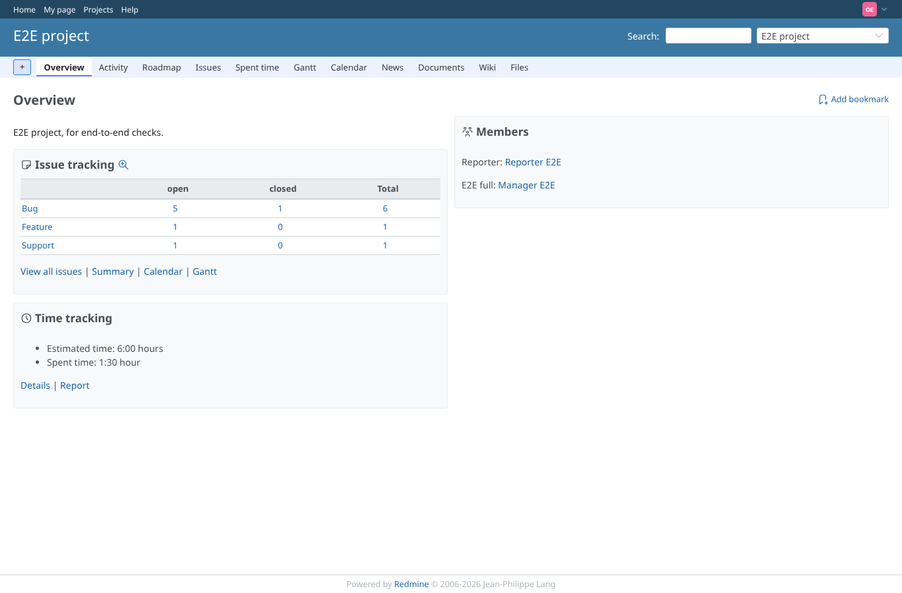
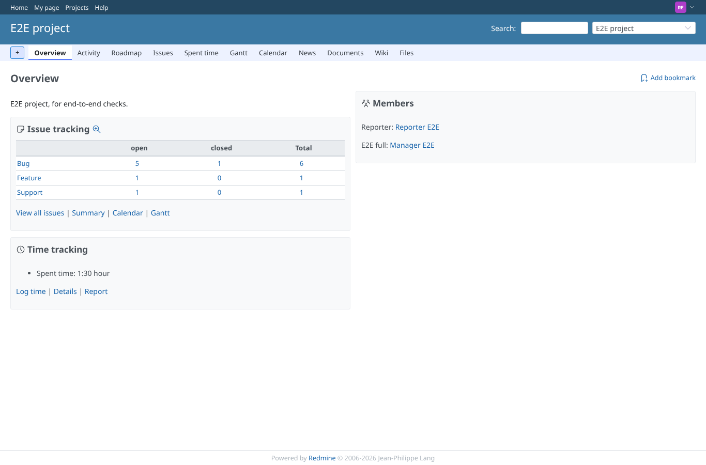

# project-overview

Run 2026-10-07T20:12:50.538Z against http://127.0.0.1:3000.

| screenshot | user | URL | shows |
|---|---|---|---|
|  | admin | `/projects/e2e-project` | admin: the time tracking box shows the estimated time total (Estimated time: 6:00) |
|  | manager | `/projects/e2e-project` | manager: the time tracking box shows the estimated time total (Estimated time: 6:00) |
|  | outsider | `/projects/e2e-project` | outsider: the time tracking box shows the estimated time total (Estimated time: 6:00) |
|  | reporter | `/projects/e2e-project` | Reporter (estimated time hidden): the box shows spent time only ("Time tracking Spent time: 1:30 hour Log time | Details | Report") |
|  | reporter | `/projects/e2e-private` | Reporter: the private project stays refused |
|  | outsider | `/projects/e2e-private` | Outsider: the private project stays refused |
