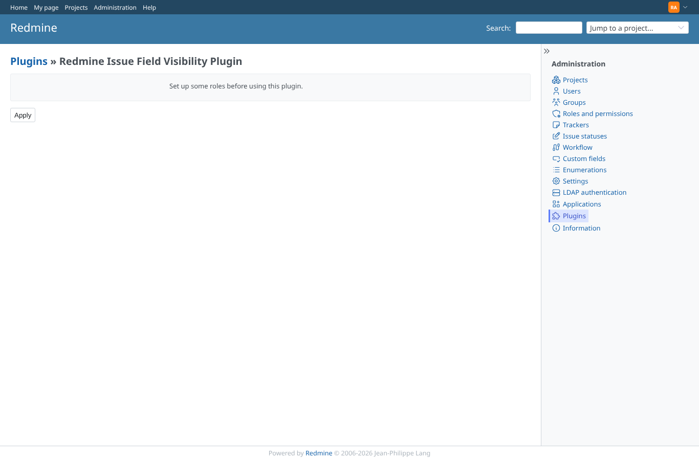
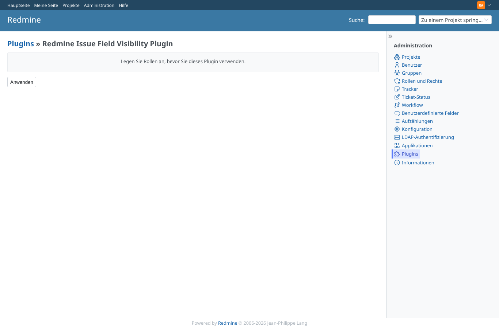
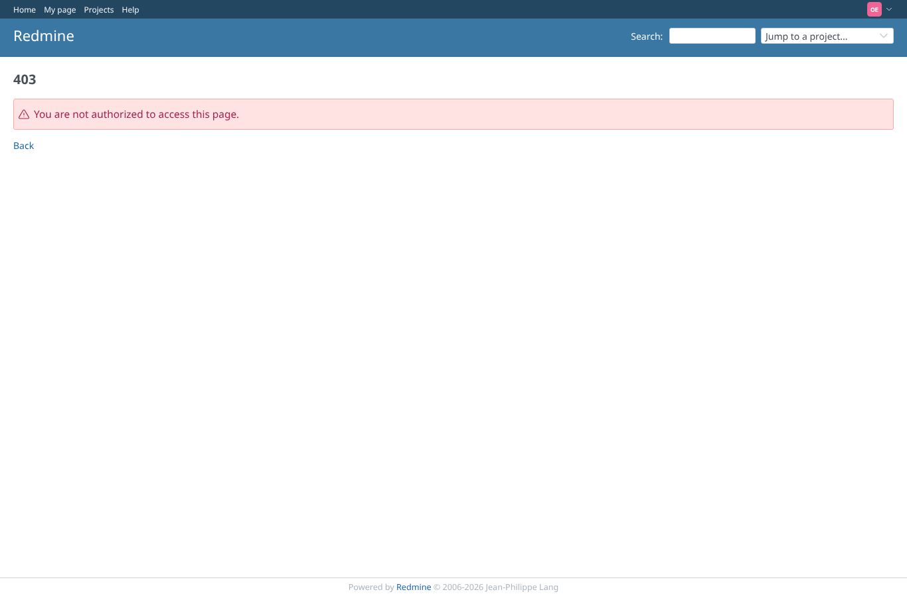
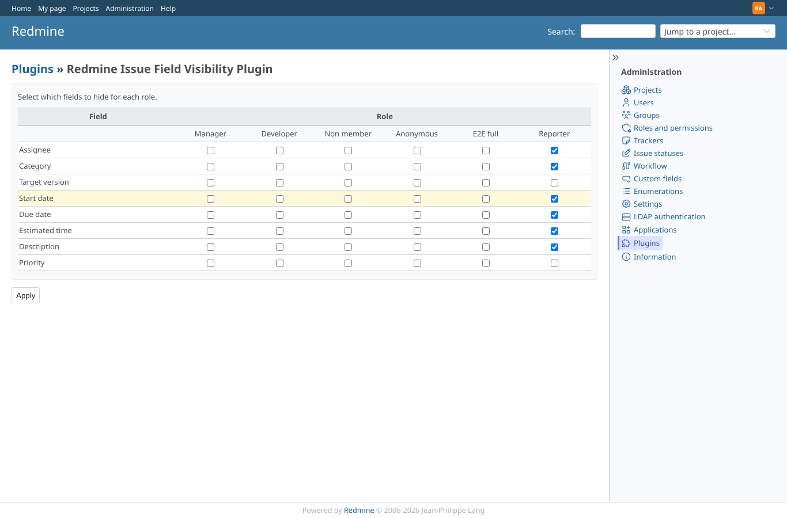

# settings-no-roles

Run 2026-10-07T20:13:01.292Z against http://127.0.0.1:3000.

| screenshot | user | URL | shows |
|---|---|---|---|
|  | admin | `/settings/plugin/redmine_issue_field_visibility` | Admin, English: no roles, the hint instead of the matrix |
|  | admin | `/settings/plugin/redmine_issue_field_visibility` | Admin, German: the same hint in the user's language |
|  | manager | `/settings/plugin/redmine_issue_field_visibility` | manager: the settings page is refused (403) |
|  | reporter | `/settings/plugin/redmine_issue_field_visibility` | reporter: the settings page is refused (403) |
|  | outsider | `/settings/plugin/redmine_issue_field_visibility` | outsider: the settings page is refused (403) |
|  | admin | `/settings/plugin/redmine_issue_field_visibility` | Roles back: the matrix again |
