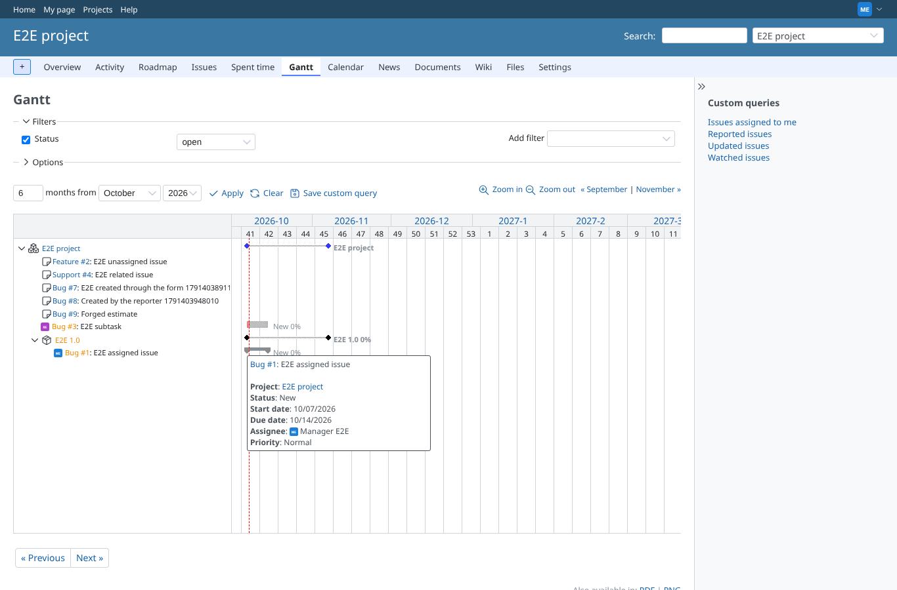
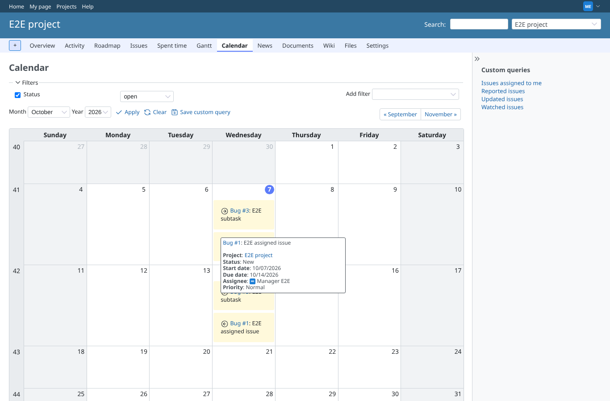
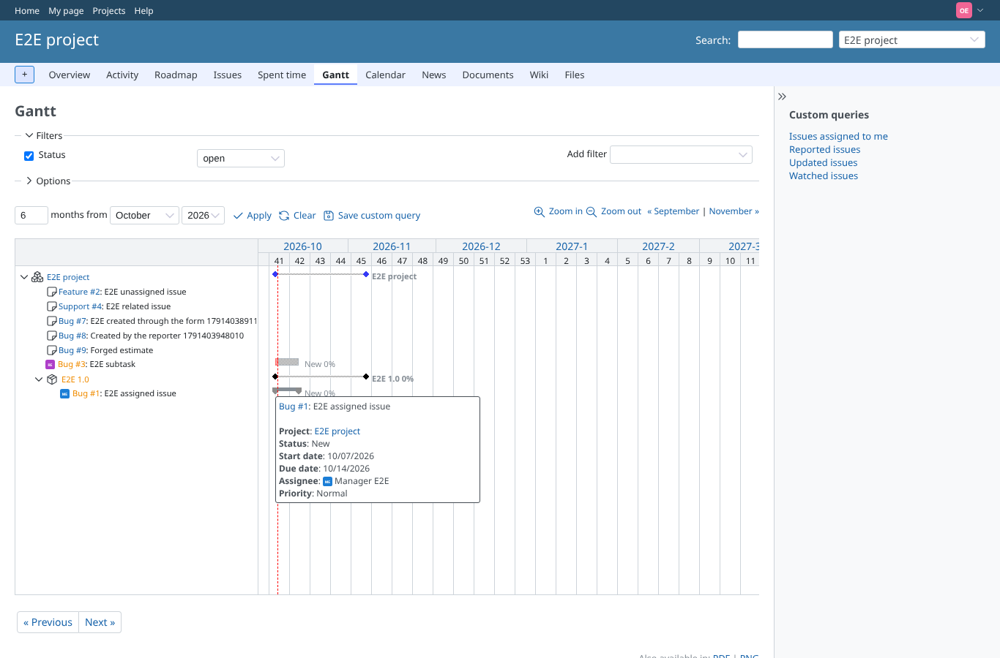
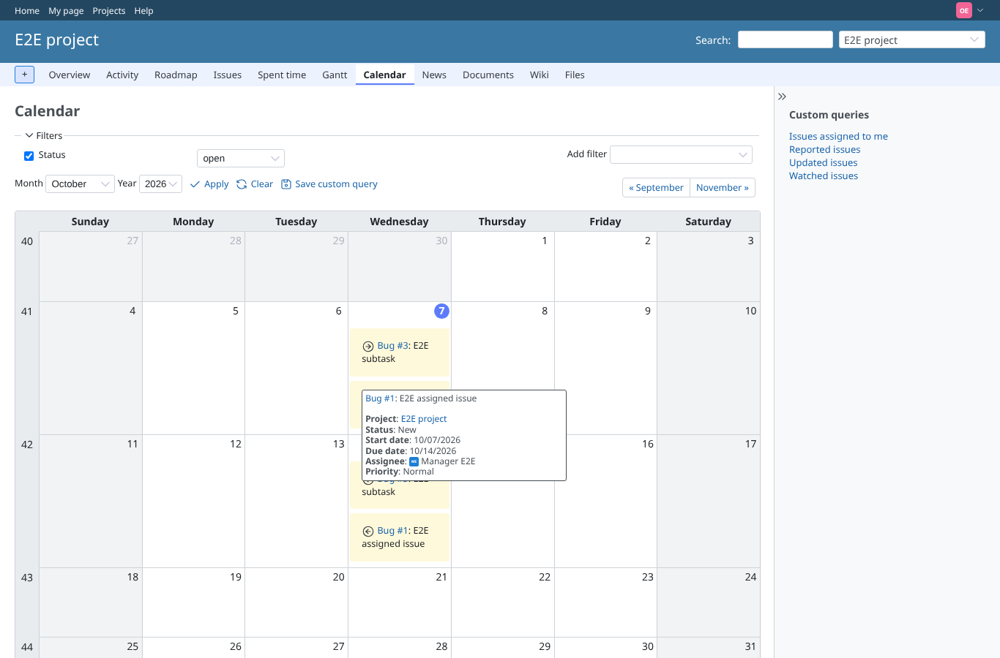
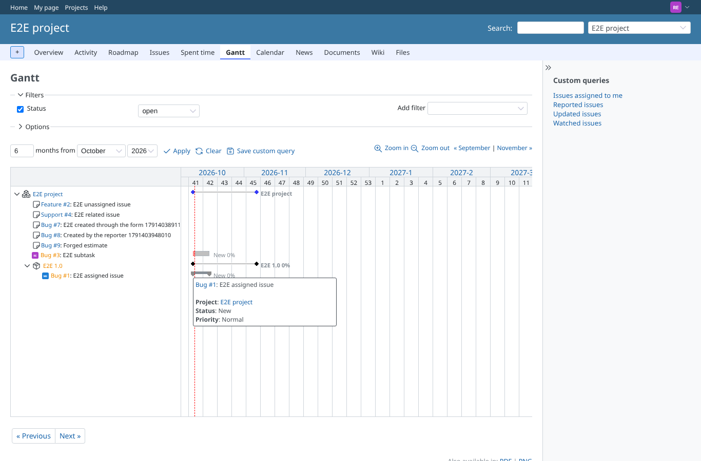
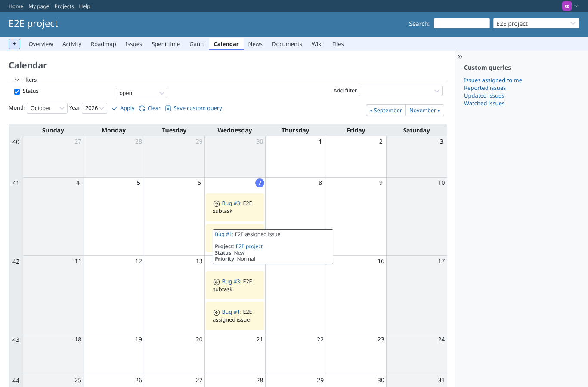
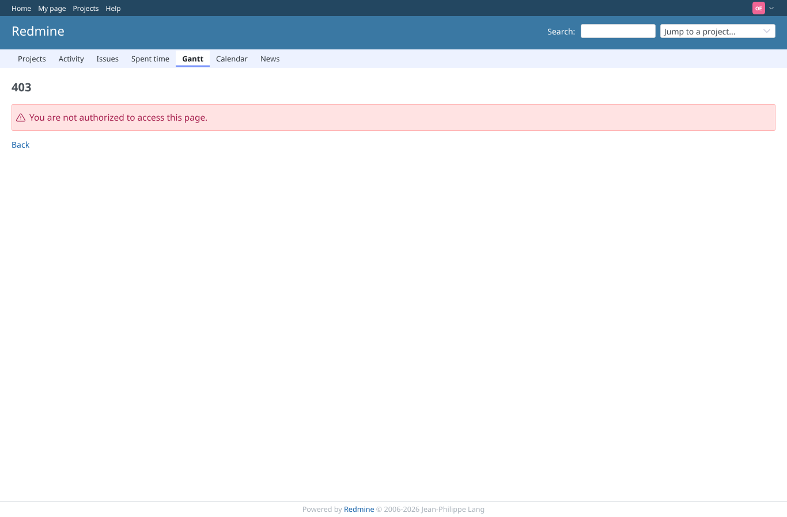

# tooltip

Run 2026-10-07T20:13:31.320Z against http://127.0.0.1:3000.

| screenshot | user | URL | shows |
|---|---|---|---|
|  | admin | `/projects/e2e-project/issues/gantt` | admin: gantt tooltip with dates and assignee "Bug #1: E2E assigned issueProject: E2E projectStatus: NewStart date: 10/07/2026Due date: 10/14/2026Assignee: ME Manager E2EPriority: Normal" |
|  | admin | `/projects/e2e-project/issues/calendar` | admin: calendar tooltip with dates and assignee "Bug #1: E2E assigned issueProject: E2E projectStatus: NewStart date: 10/07/2026Due date: 10/14/2026Assignee: ME Manager E2EPriority: Normal" |
|  | manager | `/projects/e2e-project/issues/gantt` | manager: gantt tooltip with dates and assignee "Bug #1: E2E assigned issueProject: E2E projectStatus: NewStart date: 10/07/2026Due date: 10/14/2026Assignee: ME Manager E2EPriority: Normal" |
|  | manager | `/projects/e2e-project/issues/calendar` | manager: calendar tooltip with dates and assignee "Bug #1: E2E assigned issueProject: E2E projectStatus: NewStart date: 10/07/2026Due date: 10/14/2026Assignee: ME Manager E2EPriority: Normal" |
|  | outsider | `/projects/e2e-project/issues/gantt` | outsider: gantt tooltip with dates and assignee "Bug #1: E2E assigned issueProject: E2E projectStatus: NewStart date: 10/07/2026Due date: 10/14/2026Assignee: ME Manager E2EPriority: Normal" |
|  | outsider | `/projects/e2e-project/issues/calendar` | outsider: calendar tooltip with dates and assignee "Bug #1: E2E assigned issueProject: E2E projectStatus: NewStart date: 10/07/2026Due date: 10/14/2026Assignee: ME Manager E2EPriority: Normal" |
|  | reporter | `/projects/e2e-project/issues/gantt` | Reporter (assignee and dates hidden): gantt tooltip "Bug #1: E2E assigned issueProject: E2E projectStatus: NewPriority: Normal" |
|  | reporter | `/projects/e2e-project/issues/calendar` | Reporter (assignee and dates hidden): calendar tooltip "Bug #1: E2E assigned issueProject: E2E projectStatus: NewPriority: Normal" |
|  | outsider | `/projects/e2e-private/issues/gantt` | Outsider: the gantt of the private project stays refused |
