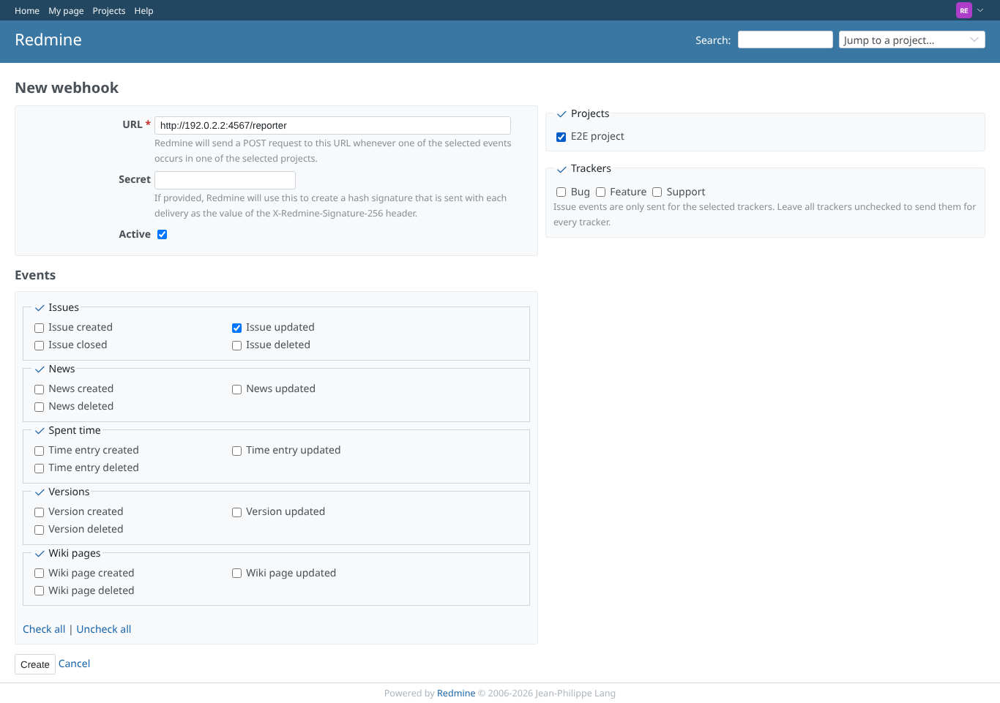
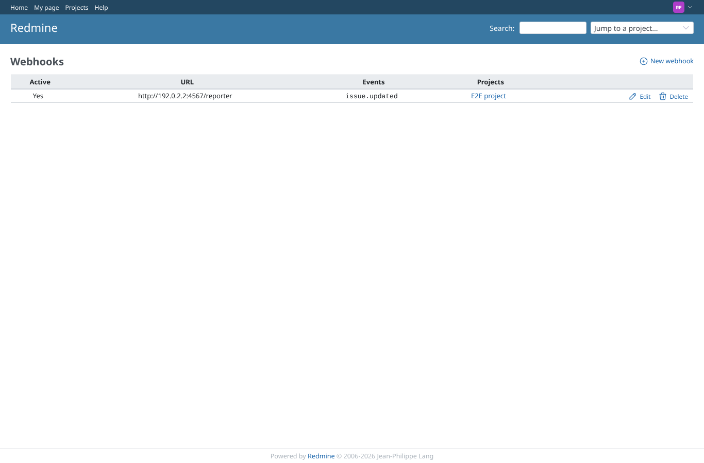
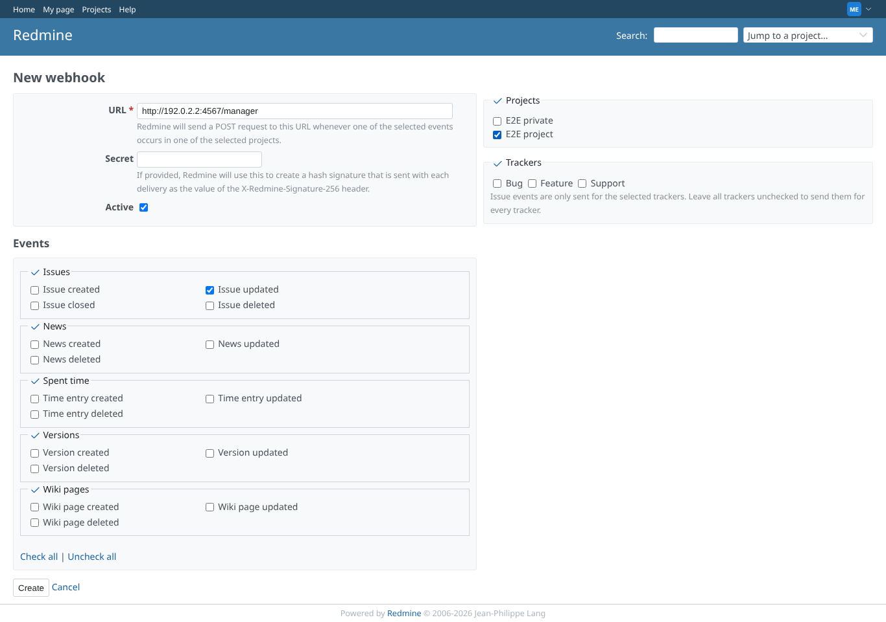

# webhooks

Run 2026-10-07T20:13:49.425Z against http://127.0.0.1:3000.

| screenshot | user | URL | shows |
|---|---|---|---|
|  | reporter | `/webhooks/new` | reporter creates a webhook for issue updates in E2E project |
|  | reporter | `/webhooks` | reporter: the webhook is saved and listed |
|  | manager | `/webhooks/new` | manager creates a webhook for issue updates in E2E project |
|  | manager | `/webhooks` | manager: the webhook is saved and listed |
