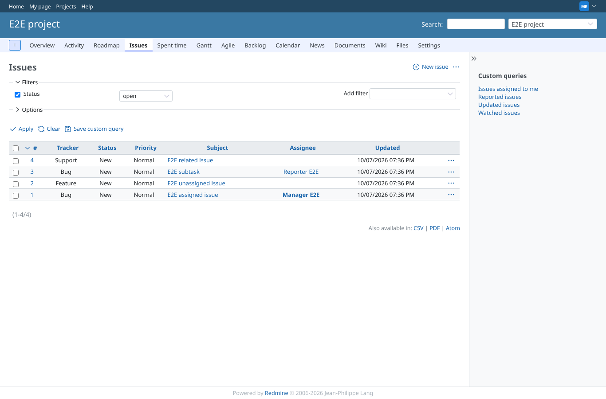
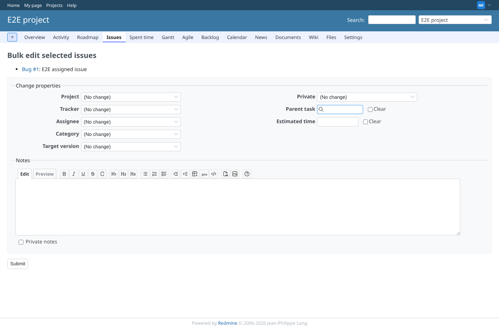
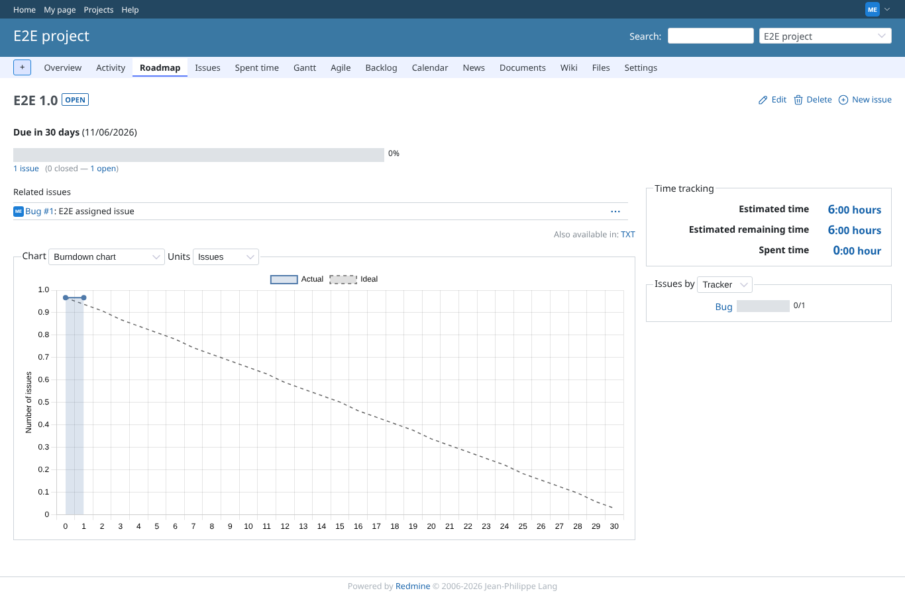
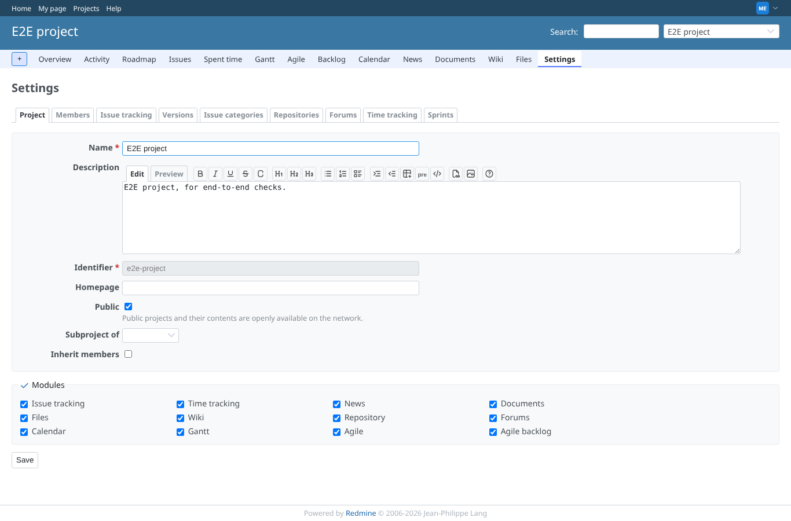
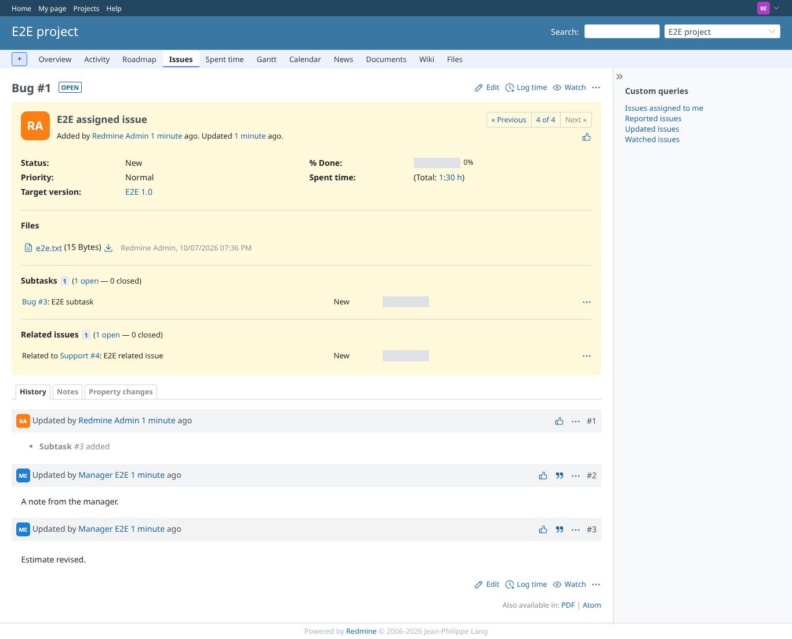
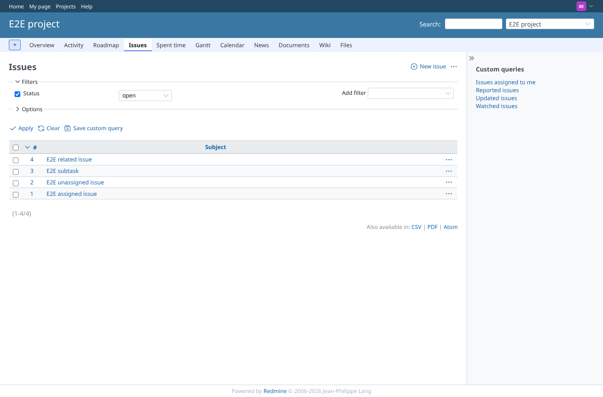
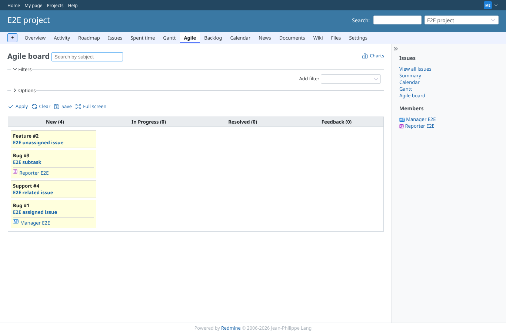

# core-pages

Run 2026-10-07T19:37:49.977Z against http://127.0.0.1:3001.

| screenshot | user | URL | shows |
|---|---|---|---|
|  | manager | `/projects/e2e-project/issues` | manager: /projects/e2e-project/issues answers 200 |
|  | manager | `/issues/bulk_edit?ids[]=1` | manager: /issues/bulk_edit?ids[]=1 answers 200 |
|  | manager | `/versions/1` | manager: /versions/1 answers 200 |
|  | manager | `/projects/e2e-project/settings` | manager: /projects/e2e-project/settings answers 200 |
|  | reporter | `/issues/bulk_edit?ids[]=1` | reporter: /issues/bulk_edit?ids[]=1 answers 403 |
|  | reporter | `/issues/1` | reporter: /issues/1 answers 200 |
|  | reporter | `/projects/e2e-project/settings` | reporter: /projects/e2e-project/settings answers 403 |
|  | outsider | `/projects/e2e-private/issues` | outsider: /projects/e2e-private/issues answers 403 |
|  | reporter | `/projects/e2e-project/issues?set_filter=1&c[]=subject&c[]=assigned_to&c[]=estimated_hours&c[]=estimated_remaining_hours&t[]=estimated_hours` | Reporter: hidden columns left out of the issue list (, #, Subject, ) |
|  | manager | `/projects/e2e-project/agile/board` | Manager: the agile board (redmine_agile) answers 200 |
